<h1 align="center"> Consórcio de Bancos Distribuídos </h1>
<h3 align="center"> Sistema descentralizado de comunicação e gerenciamento de bancos. </h3>  

  

 
<h2> Sobre o Projeto</h2>

 

Nos tempos atuais, o sistema de pagamentos instantâneos, chamado de PIX, revolucionou a forma como as pessoas lidam com pagamentos e transferências no seu dia a dia. Isso ocorre pela facilidade e rapidez em realizar as transações financeiras, além da segurança, por ter um órgão central que gerencia todo o processo. O advento dessa ferramenta impulsionou os desenvolvedores a criar estruturas que implementem o PIX de forma prática e eficiente em diversas áreas do setor financeiro.

Visando permitir que outros tipos de sistemas possam se beneficiar dessa ferramenta, foi solicitada a implementação de um software de transações bancárias entre bancos sem um órgão central para regular as requisições. Esse sistema distribuído deve poder realizar as ações de pagamento, depósito e transferência para o mesmo banco ou em outro diferente. Além disso, o usuário pode executar um pacote de transferências, repassando dinheiro de contas em bancos diferentes do que ele está conectado no momento da solicitação.

Os requisitos para implementação do sistema são:
* Permitir a criação de contas bancárias para diversos usuários. Essas contas podem ser físicas (pessoal ou conjunta) ou jurídicas;
* O sistema deve ser distribuído, continuando o funcionamento mesmo que algum banco seja desconectado;
* Os clientes podem solicitar um pacote de transferências com contas em diferentes bancos, sendo esse um processo atômico, ou seja, se uma transferência falhar, todas devem ser abortadas;
* As transações devem ser tratadas para que não ocorra duplicação de envios ou concorrência entre os pacotes;
* Os servidores dos bancos devem ser implementados via protocolo API REST;
* Deve ser criada uma aplicação para executar as ações disponíveis para o usuário.

> ***Desenvolvedor:*** Silvio Azevedo de Oliveira

<h2> </h2> 

<h1 align="center"> Sumário </h1>

	<ul>
		<li><a href="#comunicacaoPerifericos"> Comunicação entre os Periféricos </a></li>
		<li><a href="#algoritmoTratamentoConcorrencia"> Algoritmo de Tratamento de Concorrência </a> </li>
		<li><a href="#requisicoesUsuario"> Requisições do Usuário </a> </li>
		<li><a href="#execucaoPacotes"> Execução de Pacotes </a> </li>
    <li><a href="#inicializacaoBancos"> Inicialização dos Bancos </a> </li>
    <li><a href="#perdaConexaoBancos"> Perda de Conexão entre Bancos </a> </li>
		<li><a href="#aplicacaoGerenciamento"> Aplicação de Gerenciamento </a> </li>
    <li><a href="#logicaGeralSistema"> Lógica Geral do Sistema </a> </li>
		<li><a href="#organizacaoProjeto"> Organização do Projeto </a> </li>
    <li><a href="#execucaoSistema"> Execução do Sistema </a> </li>
    <li><a href="#conclusao"> Conclusão </a> </li>
		<li><a href="#referencias"> Referências </a> </li>
	</ul>	

  

 <h2> Comunicação entre os Periféricos </h2>

 

Uma aplicação de acesso do cliente deve poder se comunicar com qualquer banco do consórcio. Aquele que receber a solicitação executará a ação de cadastro ou criação de conta. Todas as comunicações do sistema são feitas seguindo a estrutura API REST, portanto, é utilizado o protocolo HTTP para transferência de dados (Figura 1).

  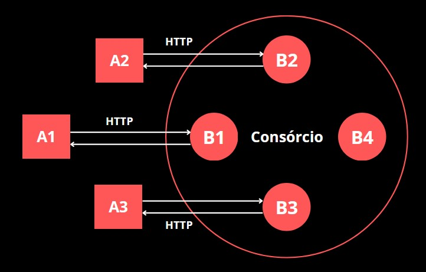

<strong> Figura 1 - Comunicação entre aplicação e bancos </strong> 

Os bancos devem poder se comunicar entre si para coletar dados referentes a um cliente, transferir dinheiro ou executar pacotes de transferências que tenham sido solicitados. Esses pacotes podem incluir transferências de contas do cliente em diferentes bancos, assim, além de realizar uma transação, o banco também pode fazer uma solicitação de transação para outro banco. A comunicação entre os bancos também é via protocolo HTTP (Figura 2).

  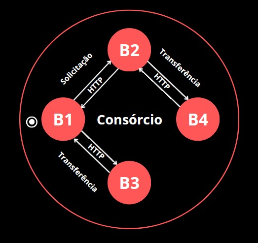

<strong> Figura 2 - Comunicação entre bancos </strong> 

  

 <h2> Algoritmo de Tratamento de Concorrência </h2>

 

As movimentações financeiras no sistema precisam ocorrer de forma ordenada para que não se prejudiquem. Essa organização se torna mais necessária pela possibilidade de solicitação de pacotes atômicos, em que são requisitadas diversas transferências e o sucesso de cada operação depende do sucesso do pacote como um todo. Assim, se uma operação falhar, todas as operações do pacote devem ser revertidas.

O algoritmo utilizado para realizar essa ordenação foi o de topologia em anel. Nesse algoritmo, é passado pelos bancos uma estrutura de dados chamada de *token*, e essa estrutura é utilizada para determinar a ordem de execução dos pacotes no sistema. A passagem entre os bancos segue a ordem crescente referente ao número de IP.

A seguir, as especificações de como o algoritmo foi implementado e como ele trata os casos de concorrência.

<h3> Inicialização do Token </h3>

Quando um banco é iniciado, ele checa se os outros bancos do consórcio estão prontos para conexão, caso nenhum esteja, ele continua fazendo essa checagem repetidamente, em intervalos de tempo determinados, até que pelo menos algum outro banco possa se conectar (Figura 3).

  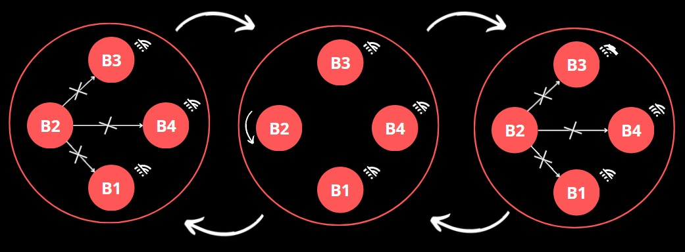

<strong> Figura 3 - Verificação de conexão com os bancos </strong> 

Quando algum outro banco está pronto para comunicação, a passagem do *token* pode ser iniciada. 

Primeiramente, é verificado, entre os bancos que estão *online*, se o banco atual é o que tem o menor número de IP, se for, ele é o que tem maior prioridade e deve ser o responsável por criar o *token* e começar a circulá-lo. Porém, antes disso, ele verifica, com o banco *online* que tem IP posterior ao dele na ordem de passagem do token, se o *token* já está circulando no sistema. 

> Observação: Nos exemplos das Figuras a seguir, vamos supôr que o número depois do "B" representa o número de IP do banco.

> Observação: As Figuras são ilustrações genéricas da troca de mensagens entre os bancos, não representando diretamente as mensagens trocadas. Todas elas são mensagens **confiáveis** e contém retorno para assegurar o remetente do recebimento da mensagem.

No exemplo da Figura 4, o **B2** é o banco *online* com a maior prioridade, por isso, ele pergunta ao **B3** se o *token* já está no sistema, e é retornada a resposta negativa. Assim, o **B2** inicia a passagem do *token*. Da parte do **B3**, como ele não tem maior prioridade, o *loop* de checagem continua checando regularmente se ele é o banco *online* com maior prioridade até que o *token* seja recebido.

  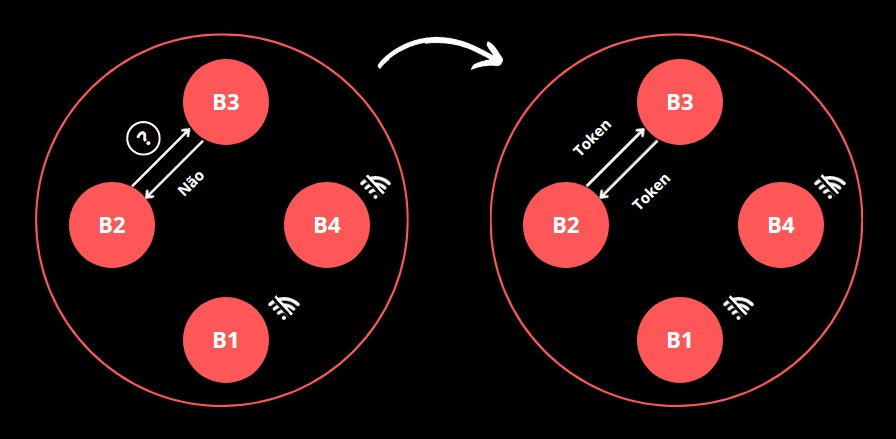

<strong> Figura 4 - Inicialização da passagem do token </strong> 

Quando os bancos tentam enviar alguma mensagem para algum banco em qualquer caso do sistema e a conexão não ocorre, é iniciado um *loop* de reconexão para saber quando o banco estiver disponível. Por isso, o **B3** tem conhecimento que o **B4** está **offline** e não tenta mandar o *token* para ele, mesmo sendo o próximo banco na ordem de prioridade de envio do *token*.

Caso o **B4** fique disponível, ele vai entrar no *loop* de checagem inicial e saberá que existem dois bancos disponíveis além dele. Como ele não tem maior prioridade entre eles, ficará no *loop* até que o *token* seja recebido (Figura 5). Os outros bancos saberão que o **B4** está disponível pelo *loop* de reconexão falado anteriormente.

  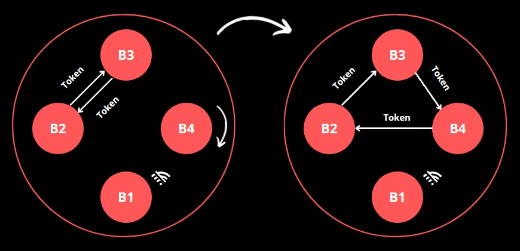

<strong> Figura 5 - Banco inicializado com o token já no sistema </strong> 

Caso o **B1** fique disponível, ele vai checar os bancos que estão *online* e verá que ele é o que tem a maior prioridade. Será enviada a mensagem para o próximo banco na ordem de passagem para saber se o *token* já está circulando. O **B2** retornará a resposta positiva e o **B1** sairá do *loop* e esperará o *token* normalmente (Figura 6). 

  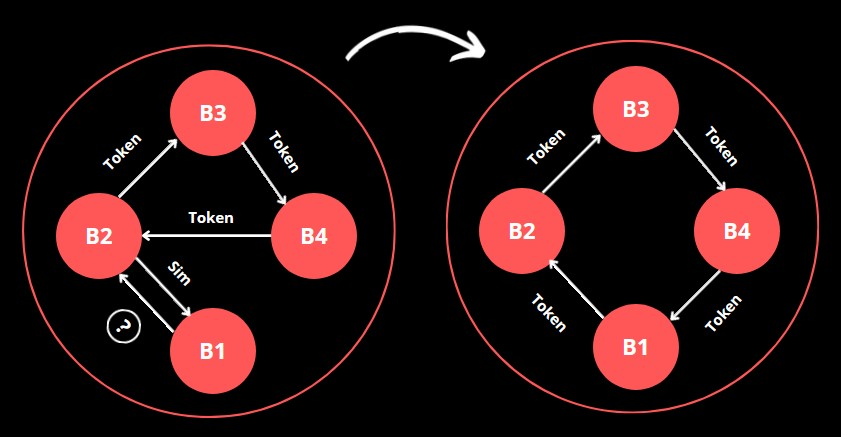

<strong> Figura 6 - Banco com maior prioridade inicializado com o token já no sistema </strong> 

Neste momento, todos os bancos do sistema foram inicializados normalmente e o *token* está circulando. O processo é o mesmo independente da quantidade de bancos do consórcio.

<h3> Ordenação de Pacotes </h3>

Quando um banco possui pacotes a serem executados, ele insere os dados desses pacotes em uma **fila** no *token*, juntamente com o seu próprio IP, e passa adiante. O *token* é uma **estrutura de dicionário**, portanto, ele pode armazenar esses dados. O banco mantém os pacotes no seu armazenamento, juntamente com a indicação que eles foram adicionados ao *token*.

Além dos dados dos pacotes, a estrutura do *token* também armazena quantas vezes ele passou por cada banco. O primeiro banco que ele passar pela segunda vez naquele determinado **"ciclo"** deve ser o que executará os pacotes da fila.

Após a execução de cada pacote, o banco que está executando envia para o banco de origem do pacote se a execução teve sucesso ou não. 

Quando todos os pacotes são executados, a fila dos pacotes é limpa, os dados sobre a quantidade de vezes que o *token* passou por cada banco são zerados (iniciando um novo **"ciclo"**), os pacotes em espera do banco atual são inseridos e, posteriormente, o *token* é passado adiante.

<h3> Detecção e Tratamento de Falhas </h3>

Os dois possíveis **problemas** que podem prejudicar o funcionamento do sistema são: um banco cair possuindo o *token*, ou mais de um estiver circulando entre os bancos. Para cada um desses casos foi implementado uma forma de detecção, que são apresentadas a seguir, juntamente com sua forma de tratamento.

* **Detecção de perda:**

Cada banco possui uma contadora que cronometra a quantidade de tempo que o banco ficou sem o *token*. Esse tempo é aumentado dependendo da quantidade de bancos presentes no consórcio.

Caso o tempo ultrapasse o limite, significa que o *token* pode ter se perdido. Para confirmar, o banco que detectou a ausência do *token* envia uma mensagem em ***multicast*** para todos os bancos do consórcio perguntado se eles possuem o *token*. Se alguém possuir, a contagem é zerada, caso contrário, o *token* se perdeu e o algoritmo de tratamento de falhas é executado.

* **Detecção de duplicação:**

Quando um *token* é criado, é inserido em seu armazenamento uma estrutura contendo a quantidade de vezes que ele passou por cada banco do consórcio. Cada banco armazena sua própria contadora que é sincronizada com a do *token*.

Quando o *token* chega em um banco, esse valor da contadora é comparado ao que está armazenado no *token*. Se não for equivalente, significa que esse *token* não é o que foi recebido anteriormente, representando um caso de falha no sistema. Assim, o algoritmo de tratamento de falhas é executado.

* **Tratamento de falhas:**

Para os dois casos, a forma de tratamento é a mesma. Primeiramente, o banco que identificou a falha procura, entre os bancos *online*, qual o que tem a maior prioridade, ou seja, o menor número de IP, e envia para ele um alerta para lidar com a falha (Figura 7). Caso o banco atual já seja o de maior prioridade, ele mesmo lidará com a falha.

  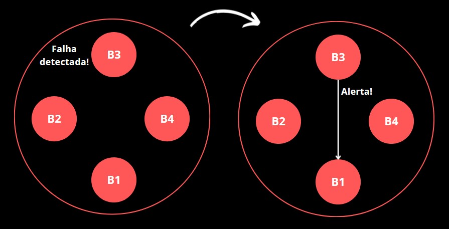

<strong> Figura 7 - Banco detecta falha e envia o alerta para o banco de maior prioridade (menor IP) </strong> 

O banco responsável por lidar com a falha vai enviar para a maioria dos bancos *online* do consórcio um alerta indicando que uma falha ocorreu. Caso ele receba mais algum alerta para lidar com a falha, será ignorado, pois ele já está tratando o ocorrido.

Quando os bancos recebem esse sinal de alerta do banco de maior prioridade, o seu sistema vai para um estado de **bloqueio temporário**. O banco responsável por lidar com a falha também vai para esse estado depois de avisar a todos. Esse processo é mostrado na Figura abaixo. Note que o banco que identificou a falha não recebe o alerta e entra para o estado sozinho, já que ele já está ciente da situação.

  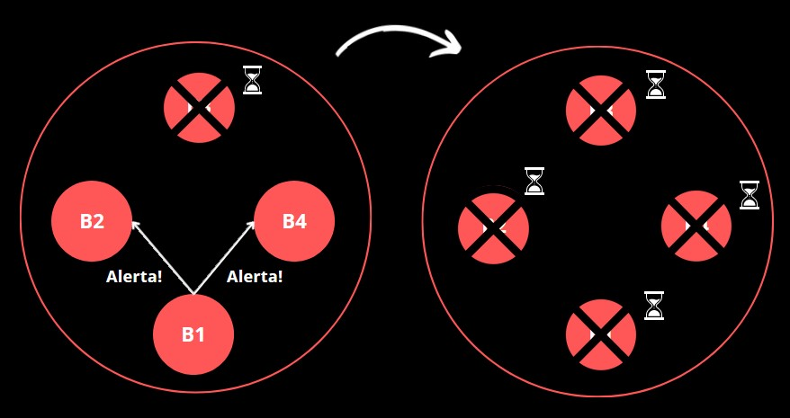

<strong> Figura 8 - Banco de maior prioridade alertando sobre a falha </strong> 

Qualquer *token* recebido com o banco nesse estado será descartado e não será passado adiante, tratando, assim, o caso de **duplicação**. 

O intervalo do bloqueio também é importante para esperar todos os bancos receberem o alerta e terem tempo de se adaptar.

Depois do intervalo de tempo, o bloqueio é encerrado e o banco volta para o estado inicial, em que ele checa os bancos que estão *online* e espera o de maior prioridade reenviar o *token*. O banco que lidou com a falha também volta pra esse estado e como ele tem maior prioridade, ele enviará o novo *token.*

Se algum pacote tivesse sido enviado para execução, mas não foi executado antes do *reset* do sistema, o banco indica que ele não está mais no *token* e tentará colocá-lo novamente na fila quando receber o novo *token*.

  

 <h2> Requisições da API REST </h2>

 

A seguir, os principais caminhos da API REST, suas descrições e dados de envio e resposta importantes de serem mencionados.

***Registrar usuário***
 
  * Método: **POST**;
  * Caminho: **/register/user**.

Os dados necessários para o cadastro do usuário no armazenamento do banco são o seu nome e o seu CPF. Abaixo, a estrutura da requisição.

  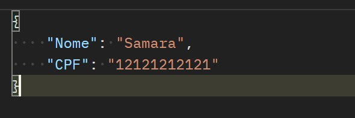

<strong> Figura 9 - Exemplo de estrutura para registro de usuário </strong> 

Caso o registro seja bem sucedido, é indicado pelo retorno. Não é permitido dois usuário terem o mesmo CPF, por isso, a requisição é mal sucedida se o CPF indicado já estiver registrado no sistema, retornando a resposta abaixo.

  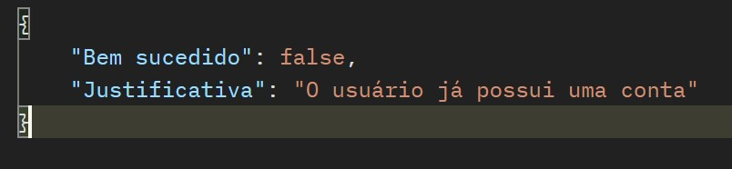

<strong> Figura 10 - Resposta caso o registro do usuário seja mal sucedido </strong> 

***Consultar registro do usuário***

  * Método: **GET**;
  * Caminho: **/check/user**.

Para checar o registro do usuário, é utilizado o seu CPF como dado da requisição. Se o usuário não for encontrado, é retornada a resposta. Caso ele esteja registrado, é retornado o resultado da busca e o nome do usuário, como mostrado abaixo.

  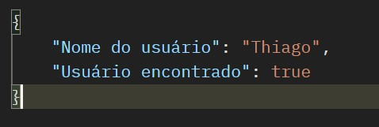

<strong> Figura 11 - Exemplo de resposta para checar registro do usuário </strong> 

***Registrar conta***
  
  * Método: **POST**;
  * Caminho: **/register/account**;

Para fazer o registro de uma conta, é necessário indicar o tipo de conta e os CPFs que estão vinculados a ela, como mostrado abaixo.

  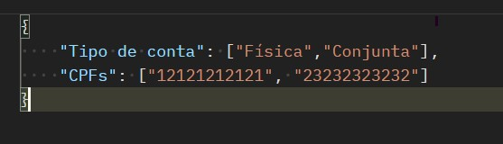

<strong> Figura 12 - Exemplo de requisição de criação de conta conjunta </strong> 

Somente a conta física conjunta e a jurídica podem ter mais de um CPF vinculado.

O registro só é bem sucedido se todos os CPFs indicados são de usuários registrados no banco e, no caso de uma conta física pessoal, se o usuário não possuir nenhuma. Em caso de falha no registro, são retornadas as respostas abaixo relacionadas aos casos citados acima, respectivamente.

  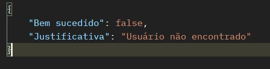

<strong> Figura 13 - Exemplo de resposta de falha para usuário não encontrado </strong> 

  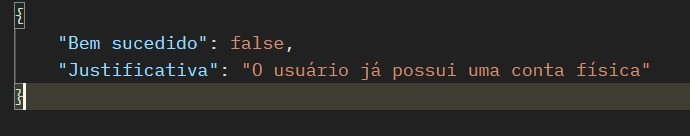

<strong> Figura 14 - Exemplo de resposta de falha para registro de conta física pessoal para usuário que já à possui </strong> 

***Consultar contas do consórcio***

  * Método: **GET**;
  * Caminho: **/get/account/consortium**;

A partir do CPF do usuário, é possível consultar as contas vinculadas a ele em todo o consórcio de bancos. O banco que recebe a requisição envia para os outros e organiza os dados para serem retornados.

A requisição é mal sucedida se não tiverem contas encontradas que sejam vinculadas ao usuário. Caso seja bem sucedido, o retorno contém os IPs dos bancos que possuem as contas e os dados específicos de cada uma, como no exemplo abaixo.

  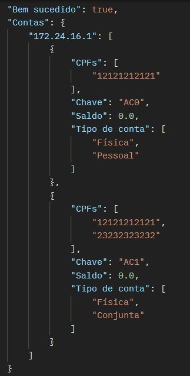

<strong> Figura 15 - Exemplo de retorno da consulta de contas no consórcio </strong> 

***Requisição de pacote***

  * Método: **PATCH**;
  * Caminho: **/request_package**;

Um pacote pode conter diversas transferências, e para cada uma delas, é necessário indicar os seguintes dados: IP do banco remetente; chave da conta remetente; IP do banco destinatário; chave da conta destinatária; e valor a ser transferido. Esses dados estão separados em listas de uma estrutura, como mostrado abaixo.

  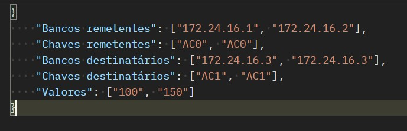

<strong> Figura 16 - Exemplo de requisição de pacote </strong> 

Para saber qual dado se refere a qual transferência, é usada as posições dos dados nas listas, sendo elas equivalentes. Por exemplo, a primeira transferência do pacote seria:

> A conta de chave AC0 do banco 172.24.16.1 deve enviar o valor 100 para a conta de chave AC1 do banco 172.24.16.3.

Para fazer apenas uma transferência, seria setado apenas um dado em cada lista.

Operações de saque e depósito também são tratadas como pacotes, apenas se modifica os dados indicados. A operação de saque contém apenas os dados do remetente setados e a de depósito, os dados do destinatário, como mostrado nos exemplos abaixo, respectivamente.

  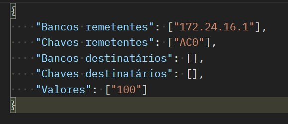

<strong> Figura 17 - Exemplo de requisição de saque </strong> 

  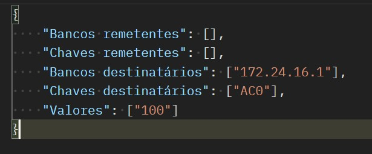

<strong> Figura 18 - Exemplo de requisição de depósito </strong> 

A resposta consiste na indicação se o pacote foi bem executado, e caso não seja, são retornadas as justificativas com a indicação do índice relacionado a transação que falhou nas listas do pacote e o motivo específico.

  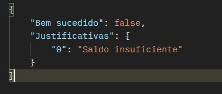

<strong> Figura 19 - Exemplo de resposta para um pacote mal sucedido </strong> 

***Passagem do token***

  * Método: **POST**;
  * Caminho: **/token_pass**;

Caminho usado para passar o token entre os bancos. Os dados contidos na passagem do token são: a estrutura contadora de execução, usada como base para saber qual banco deve executar os pacotes armazenados na passagem do token; a estrutura contadora de passagem do token, usada para identificar duplicação de token; e a lista de pacotes.

  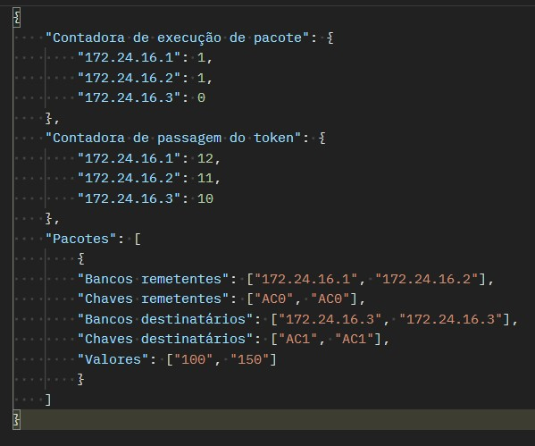

<strong> Figura 20 - Exemplo de dados armazenados na estrutura do token </strong> 

***Alerta de problema no sistema do token***

  * Método: **POST**;
  * Caminho: **/alert_problem_detected**;

O alerta de problema no sistema do token contém os dados da indicação se o banco que recebeu a mensagem deve lidar com o problema, ou não, e qual o IP do banco que está enviando o alerta, como mostrado abaixo

  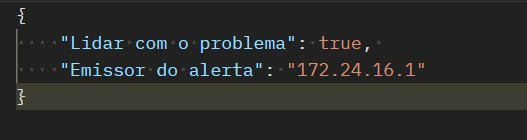

<strong> Figura 21 - Exemplo de dados do alerta de problema detectado </strong> 

A única resposta diferente da indicação que o recebimento do alerta foi bem sucedido é caso o banco já tenha recebido o alerta de outro banco. Nesse caso, é retornada a resposta abaixo.

  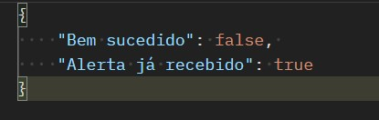

<strong> Figura 22 - Exemplo de resposta caso o banco já tenha recebido o alerta </strong> 

> Observação: existem mais caminhos, como os relacionados a transferência de dinheiro entre os bancos, porém foram apresentados acima apenas os mais pertinentes.

  

 <h2> Execução de Pacotes </h2>

 

Todas as transferências de um pacote são dependentes umas das outras, precisando reverter as ações feitas, caso alguma tenha sido falha. Para permitir que isso ocorra, foi implementado o algoritmo apresentado a seguir.

Internamente, toda conta possui dois saldos distintos, um deles é o saldo que o usuário pode acessar, transferir ou depositar dinheiro, e o outro é um **saldo bloqueado** que o usuário não tem acesso.

Quando a transferência de um pacote é feita, as contas que estão enviando o dinheiro retiram a quantia do seu saldo normal e enviam a mensagem de transferência para o banco destinatário. O dinheiro é depositado na conta do saldo bloqueado, e permanece lá. O banco remetente da transação retorna ao banco que está gerenciando os pacotes que a ação foi bem sucedida (Figura 23). 

  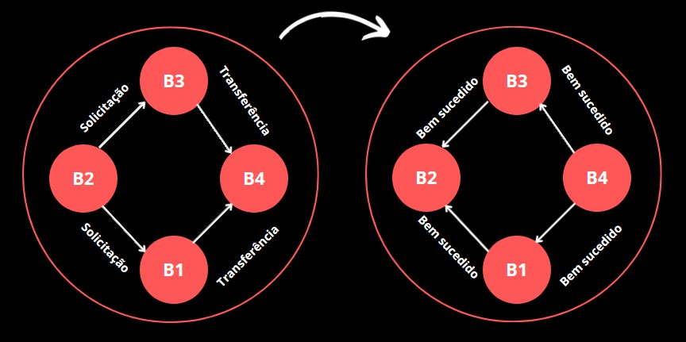

<strong> Figura 23 - Início da execução do pacote </strong> 

Se todas as transferências do pacote foram bem sucedidas, é enviado o aviso para os bancos remetentes avisarem os bancos destinatários para liberar o valor do saldo bloqueado (Figura 24). 

  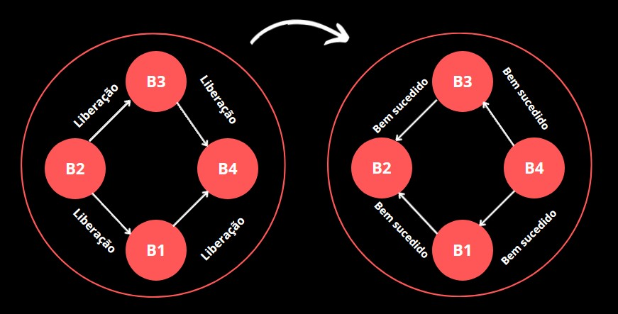

<strong> Figura 24 - Liberação do valor do saldo bloqueado </strong> 

Caso alguma transferência não seja bem sucedida, o aviso é para reembolsar o valor transferido e não liberar o saldo bloqueado para o saldo normal.

Quando o pacote é finalizado, é retornado para o banco que requisitou ele se as transações foram realizadas com sucesso ou não. Vale lembrar que o banco que executa o pacote depende da ordem de passagem no **"ciclo"** do *token*.

  

 <h2> Inicialização dos Bancos </h2>

 

Para o sistema funcionar, cada banco precisa saber antecipadamente quais bancos farão parte do consórcio. Assim, antes do servidor ser iniciado, é solicitado ao usuário a quantidade de bancos do consórcio e o IP de cada um deles, podendo, ou não, colocar o IP do banco atual, que é exibido no início do programa, como mostrado na Figura abaixo.

  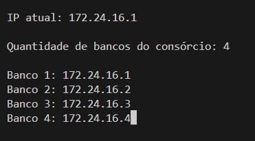

<strong> Figura 25 - Solicitação dos IPs dos bancos do consórcio </strong> 

O sistema não vai funcionar corretamente se o usuário não indicar manualmente, em cada um dos bancos, os IPs dos bancos do consórcio.

Após essa inserção, o servidor do banco é iniciado (Figura 26).

  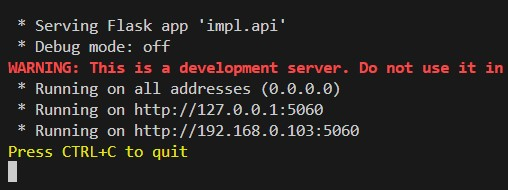

<strong> Figura 26 - Servidor do banco iniciado </strong> 

  

 <h2> Perda de Conexão entre Bancos </h2>

 

Sempre que uma mensagem é enviada para um banco e ocorre um erro de conexão, o banco que enviou a mensagem inicia, em segundo plano, um **loop de reconexão**. Nesse *loop*, ele manda uma mensagem de checagem de conexão regularmente para saber quando o banco estiver disponível novamente, enquanto ele não estiver, nenhuma outra mensagem é enviada para ele, como o envio do *token* ou a solicitação de uma transferência.

Em razão dessa checagem, quando o banco estiver disponível novamente, os que perceberam sua desconexão vão saber da sua volta.

  

 <h2> Aplicação de Gerenciamento </h2>

 

A tela inicial da aplicação de gerenciamento possui as opções de fazer o cadastro ou o *login* do usuário (Figura 27). 

  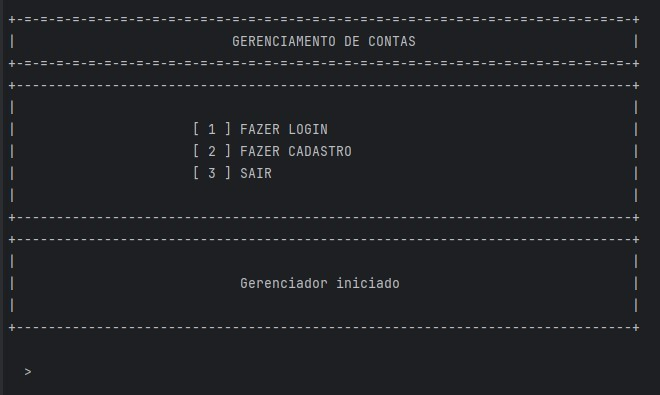

<strong> Figura 27 - Tela inicial da aplicação </strong> 

O cadastro é feito completando as informações abaixo (Figura 28).

  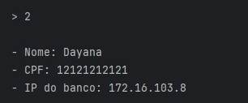

<strong> Figura 28 - Inserção de dados para cadastro do usuário </strong> 

Tendo uma conta cadastrada, ao inserir o CPF e o IP do banco ao qual deseja se conectar, a tela da conta do usuário é exibida (Figura 29).

  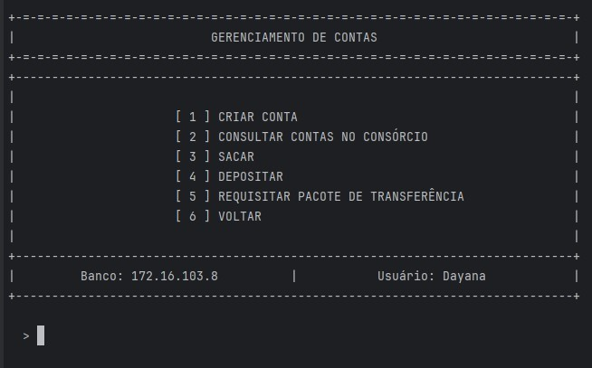

<strong> Figura 29 - Tela de opções de requisição do usuário </strong> 

A opção de "criar conta" exibe a tela de opções de contas a serem criadas (Figura 30). 

  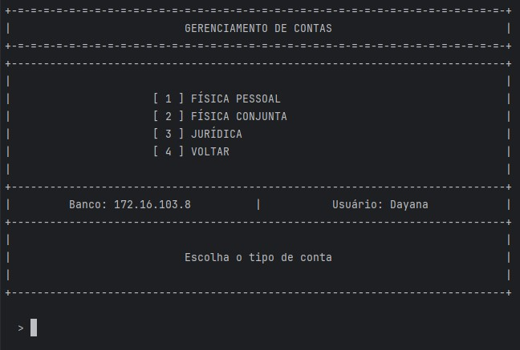

<strong> Figura 30 - Tela de seleção de tipo de conta </strong> 

A "física pessoal" cria a conta diretamente ao selecionar a opção. As outras duas pedem a quantidade de pessoas vinculadas à conta e o CPF de cada uma (Figura 31).

  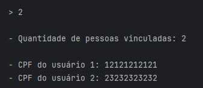

<strong> Figura 31 - Inserção da quantidade de usuários e seus CPFs </strong> 

Voltando a tela de opções do usuário, a opção de consultar contas no consórcio retorna todas as contas que o CPF do usuário está cadastrado em todos os bancos do consórcio. A mensagem de retorno exibida são os dados de todas as contas e o IP indicando o banco ao qual elas pertencem (Figura 32).

  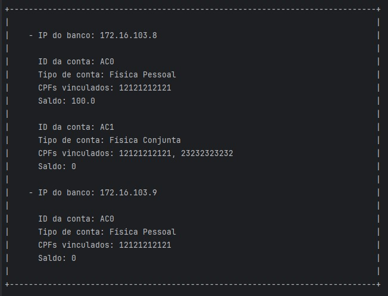

<strong> Figura 32 - Exemplo de retorno da opção de consultar contas no consórcio </strong> 

O saque e o depósito apenas pedem a chave da conta e o valor desejado (Figura 33). O resultado da requisição é exibido abaixo do IP do banco e do nome do usuário.

  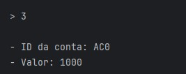

<strong> Figura 33 - Inserção de dados para realizar um saque </strong> 

Na opção de requisitar um pacote de transferências, é pedida a quantidade de transferências, e depois, elas devem ser preenchidas uma por uma (Figura 34).

  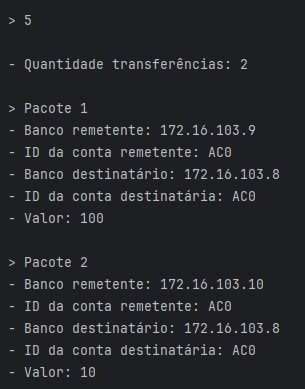

<strong> Figura 34 - Inserção de dados para requisição de um pacote </strong> 

Caso a execução do pacote seja falha, a mensagem de retorno indica qual ou quais transferências não foram bem sucedidas, juntamente com os motivos (Figura 35).

  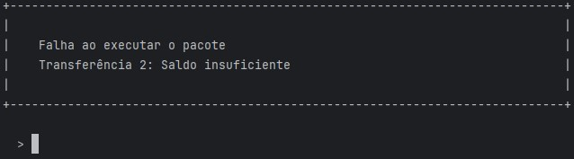

<strong> Figura 35 - Exemplo de retorno da execução de um pacote mal sucedido </strong> 

  

 <h2> Lógica Geral do Sistema </h2>

 

A seguir, como a aplicação de gerenciamento, o algoritmo de tratamento de concorrência e a forma de executar pacotes de movimentações financeiras se relacionam entre si.

Utilizando a aplicação, o cliente pode se cadastrar e criar as contas desejadas em qualquer banco disponível. Também é possível coletar os dados das suas contas no consórcio sem nenhuma restrição, não sofrendo interferência do algoritmo de tratamento de concorrência.

O algoritmo vai interferir quando o cliente requisitar uma movimentação financeira para um banco. Quando o pacote é recebido, o banco entra em um **loop de espera** que atrasa a resposta para o usuário afirmando se o pacote foi bem executado ou não (Figura 36). Esse *loop* só é encerrado quando o pacote é executado.

  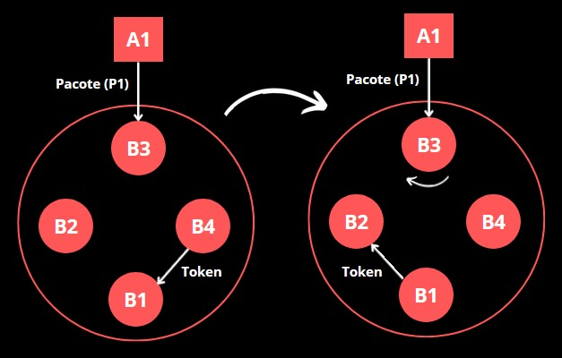

<strong> Figura 36 - Recebimento do pacote e início do loop de espera </strong> 

Quando o *token* chega ao banco que possui um pacote a ser executado, ele adiciona os dados desse pacote, juntamente com o IP do banco de origem, na fila de pacotes do *token* e passa adiante (Figura 37).

  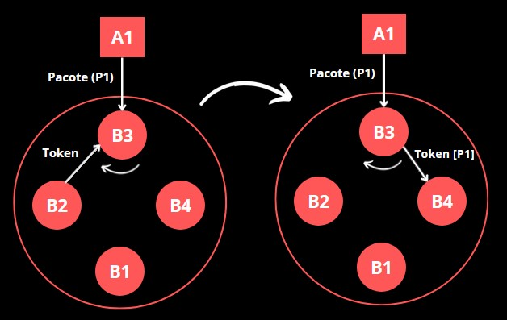

<strong> Figura 37 - Banco adiciona pacote na fila de execução </strong> 

Se tivesse mais de um pacote para ser executado no banco, também seria adicionado na fila.

O banco responsável por executar o pacote vai ser aquele que o *token* passa pela segunda vez naquele determinado **"ciclo"**. Dependendo de como o *token* iniciou e por quais bancos ele conseguiu passar, o banco responsável pode variar no decorrer da execução do sistema.

Digamos que, no exemplo dado nas Figura acima, o banco responsável pela execução dos pacotes é o **B1**. Ele vai receber o *token*, verificar que ele é o responsável pela execução e começará o processamento dos pacotes (Figura 38). 

  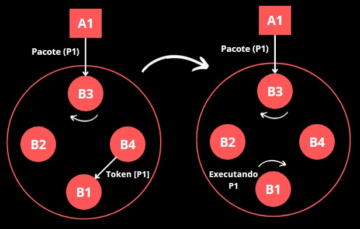

<strong> Figura 38 - Banco executa pacotes da fila </strong> 

O pacote será executado e ele pode ter sido bem sucedido ou não. Ao fim da execução desse pacote, o **B1** retorna para o **B3** o resultado da execução. Ao finalizar todos os pacotes, o **B1** limpa a fila de pacotes e repassa o *token*. Como o **B3** recebeu a resposta do pacote, ele sai do **loop de espera** e retorna o resultado para a aplicação que solicitou o pacote. Esse processo é mostrado na Figura abaixo.

  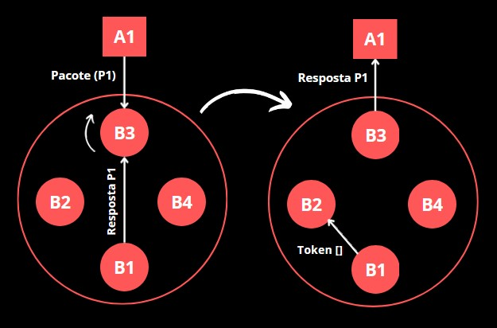

<strong> Figura 39 - Banco retorna resultado do pacote para a aplicação e token é repassado </strong> 

Esse processo seria o mesmo para mais de um pacote na fila do *token*, apenas seria executado um de cada vez e cada banco de origem receberia a sua resposta.

Esse é o processo de execução das movimentações financeiras de forma ordenada, evitando concorrência.

  

 <h2> Organização do Projeto </h2>

 

A seguir, como as funções de implementação do sistema estão distribuídas pelos arquivos do projeto.

Na pasta  <code>src/model</code> ficam as classes utilizadas no projeto, sendo elas,  <code>Database</code> (armazenamento dos dados),  <code>Account</code> (conta),  <code>User</code> (usuário) e  <code>Token</code>. As descrições delas são apresentadas abaixo:

* <code>Database</code>: Armazena os dados necessários para a implementação do sistema. Sendo eles: os bancos do consórcio; os usuários e as contas cadastradas; as funções de manipulação desses dados, entre outros;

* <code>Account</code>: Dados relacionados a conta do usuário, como, a chave, os CPFs dos usuários vinculados, saldos e o tipo de conta. Além disso, também possui as funções de manipulação dos saldos;

* <code>User</code>: Dados relacionados ao usuário, como, o CPF, o nome e a informações se ele já possui conta física pessoal;

* <code>Token</code>: Informações relacionadas a passagem do *token*, como, se o banco possui ele naquele momento, se ele está ou não passando no sistema, o tempo que o banco ficou sem receber, e a contadora de passagem do *token*.

A pasta <code>src/bank/impl</code> possui os arquivos que contém as funções de implementação do banco. A seguir a descrição de cada uma delas:

* <code>bank_impl.py</code>: Funções gerais relacionadas ao funcionamento do banco. Sendo as principais: adição dos bancos do consórcio; *loop* de checagem da passagem do *token*; transferências de dinheiro, e procura de contas do usuário no consórcio;

* <code>package_impl.py</code>: Funções relacionadas a manipulação de pacotes, como, recebimento de requisições, a adição deles no token, o seu processamento, e a confirmação de sua execução;

* <code>register_impl.py</code>: Funções de registro de usuário e de conta;

* <code>token_impl.py</code>: Funções relacionadas a passagem do *token*, como, checar se já está passando ou se o banco o possui naquele momento, contar o tempo que o banco ficou sem recebê-lo, receber o token, checar sua validade, passá-lo adiante, e as funções de tratamento de falhas;

* <code>api.py</code>: Caminhos de comunicação da API REST. Os caminhos chamam as funções dos arquivos acima para executar determinadas ações.

A pasta <code>src/bank/utils</code> contém o esboço dos envios através da biblioteca *requests*. Essa função é utilizada para implementar envios *multicast* para os bancos de forma mais rápida utilizando *threads*.  

O arquivo <code>src/application/application.py</code> contém as funções de implementação da aplicação do usuário.

Os arquivos <code>src/application/\__main__.py</code> e <code>src/bank/start/\__main__.py</code> são responsáveis por inicializar os softwares da aplicação e do servidor do banco, respectivamente.

  

 <h2> Execução do Sistema </h2>

 

Existem três formas de executar o sistema: executando o arquivo diretamente; construindo a imagem do *Docker* e executando; ou baixando a imagem do *Docker Hub* e executando.

* Executando o arquivo diretamente:

Para executar o servidor do banco, entre na pasta <code>src/bank/start</code> e execute no terminal o seguinte comando:

    Para Windows: py __main__.py
    Para Linux: python3 __main__.py

Para executar a aplicação, entre na pasta <code>src/application</code> e execute no terminal o seguinte comando:

    Para Windows: py __main__.py
    Para Linux: python3 __main__.py

* Construindo imagem Docker e executando:

Entre na pasta <code>src</code> e execute os seguintes comandos no terminal para construir a imagem Docker do servidor do banco e da aplicação, respectivamente:

    docker build -f dockerfile_bank -t bank .
    docker build -f dockerfile_app -t app .

Para executar a imagem, utilize os seguintes comandos para o servidor do banco e para a aplicação, respectivamente:

    docker run -i --network host -e TERM=xterm bank
    docker run -i --network host -e TERM=xterm app

* Baixando a imagem do Docker Hub e executando:

Para baixar a imagem do servidor do banco e da aplicação, respectivamente, no Docker Hub, deve-se utilizar os comandos:

    docker pull silviozv/bank_pbl2
    docker pull silviozv/app_pbl2

Para executar as imagens do servidor do banco e da aplicação, respectivamente, utiliza-se os comandos:

    docker run -i --network host -e TERM=xterm silviozv/bank_pbl2
    docker run -i --network host -e TERM=xterm silviozv/app_pbl2

  

 <h2> Conclusão </h2>

 

Foi implementado um sistema distribuído de servidores que desempenham papel de entidades bancárias, em que é possível para o usuário, a partir da aplicação de gerenciamento, fazer suas requisições desejadas. As operações de movimentação financeira ocorrem com êxito, até mesmo as que são solicitadas em pacote, revertendo todas as operações caso alguma não tenha sido bem sucedida. 

O algoritmo utilizado para o tratamento de concorrência evita que mais de um pacote de movimentação financeira esteja sendo executado ao mesmo tempo. Os erros que podem ocorrer no algoritmo são tratados, conseguindo, assim, retornar o sistema ao seu bom funcionamento.

Uma ideia de melhoria útil para o sistema seria poder acrescentar mais bancos enquanto o consórcio já foi inicializado.

Em conclusão, todos os requisitos propostos no projeto foram implementados com êxito e o sistema funciona corretamente. 

  

 <h2> Referências </h2>

 

FCamara (2023). "Pix: o que é e quais são os benefícios?". Disponível em: https://fcamara.com/blog/o-que-e-pix/. Acesso em: 02 de julho de 2024.

NASCIMENTO, A. "SISTEMAS DISTRIBUÍDOS
CAPÍTULO 6 – SINCRONIZAÇÃO". Disponível em: http://profs.ic.uff.br/~simone/sd/contaulas/aula14.pdf. Acesso em: 02 de julho de 2024.

